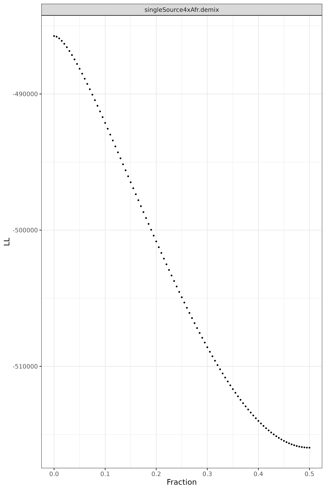
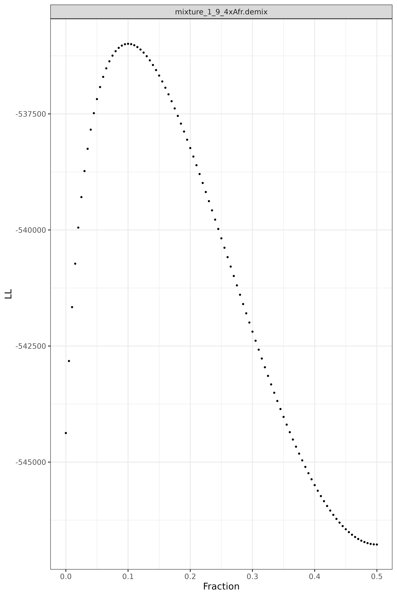

# Examples!

It's helpful to consider some examples. We'll consider two; one that's a single source sample, and another that's a mixture.
Since these data are public, let's consider something synthetic...

# Single source data

Let's simulate some single source data!

```
bcftools view -H ../hg38/GSA-24v3-0_A2.hg38.gnomadannos.autos.sites2include.justafs.bcf | python3 ../../makeRandos.py -t 4 -F AF_afr -q 30 -s 1 -r 0 | cut -f-9 | ../../demix -d /dev/stdin > singleSource4xAfr.mf
```

Which a 4x (*-t 4*) single source (*-r 0*) African/African American sample (*AF_afr*) for sites in the GSA (*bcftools view*), removing all known genotype calls (*cut*). <br>
These data are given to Demixity (*|*), which is run using the default parameters.

The format of the file we made (singleSource4xAfr.mf) is described [here](../../MFfile.md)

Looking at the first few lines of the file tells you a lot:
```
head singleSource4xAfr.mf
```

Gives a header-less TSV file (I added headers to make it more readable)


| label | mf  | log-likelihood  |
| ----- | --- | ------- |
| mf |     0.0000  |  -485744.351157961 |
| mf  |   0.0050 |  -485794.490664077 |
| mf   |   0.0100 | -485920.359570402 |
| mf   |   0.0150 | -486098.669672224 |


The basic idea of maximum likelihood techniques is to find the parameter value (mf) that maximizes the likelihood function. Log-likelihoods operate in the same way (log is a monotonic transformation, meaning that big things stay big, and small things stay small); since we're working with negative numbers, you want the log-likelihood that's closest to 0, which so happens to be the first value in the table. The associated mixture fraction is 0, suggesting that the data given is **not** a mixture. (good thing, because we know it's not!)

You can visualize the MF file ```mfPretty.R``` (note, this requires R and the tidyverse library to be installed)



<br>
which contrasts the log-likelihod (y-axis) versus the mixture fraction (Fraction)

# Mixtures

Now, let's make a mixture! As it stands, *Demixtify* only considers (up to) two-person mixtures. Here's how we can make one:
```
bcftools view -H ../hg38/GSA-24v3-0_A2.hg38.gnomadannos.autos.sites2include.justafs.bcf | python3 ../../makeRandos.py -t 4 -F AF_afr -q 30 -s 1 -r 0.1 | cut -f-9 | ../../demix -d /dev/stdin > mixture_1_9_4xAfr.demix 
```

where the mixture is 1:9 (10%, *-r 0.1*) and the sample is again a 4x genome.
Let's take a quick look at the file we made:

```
head -n 30 mixture_1_9_4xAfr.mf
```

which gives:

| label | mf  | log-likelihood  |
| ----- | --- | ------- |
|mf|0.0000|-544373.797493750|
|mf|0.0050|-542822.378607932|
|mf|0.0100|-541661.709506427|
|mf|0.0150|-540726.174477815|
|mf|0.0200|-539948.807631765|
|mf|0.0250|-539292.145167973|
|mf|0.0300|-538732.123496242|
|mf|0.0350|-538251.980593435|
|mf|0.0400|-537839.389544331|
|mf|0.0450|-537484.922400379|
|mf|0.0500|-537181.149652060|
|mf|0.0550|-536922.076439312|
|mf|0.0600|-536702.771325196|
|mf|0.0650|-536519.111878385|
|mf|0.0700|-536367.604532489|
|mf|0.0750|-536245.253532927|
|mf|0.0800|-536149.463383142|
|mf|0.0850|-536077.964784514|
|mf|0.0900|-536028.757445578|
|mf|0.0950|-536000.065252881|
|mf|0.1000|**-535990.300659860**|
|mf|0.1050|-535998.036068408|
|mf|0.1100|-536021.980580622|
|mf|0.1150|-536060.960932980|
|mf|0.1200|-536113.905723596|
|mf|0.1250|-536179.832261211|
|mf|0.1300|-536257.835518189|
|mf|0.1350|-536347.078787231|
|mf|0.1400|-536446.785736910|
|mf|0.1450|-536556.233604883|


<br>
If we look carefully, we can see that the log-likelihood closest to 0 just so happens to be for a 10% mixture fraction (and for the cynics in the audience, no, I didn't cherry pick this example)
Very cool!

We can also visualize the likelihood profile:



And we can see the same thing as the table above, but in a prettier way.